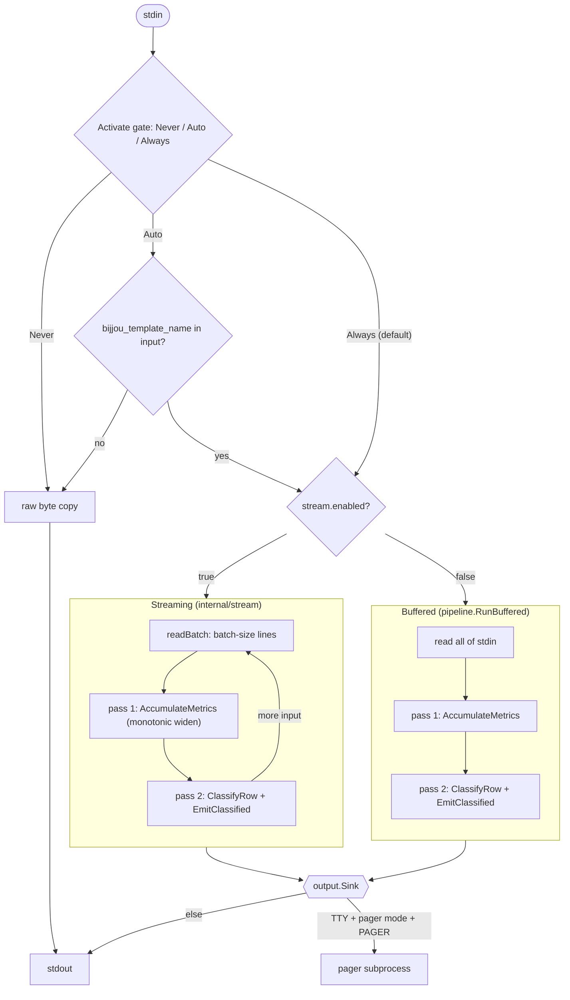
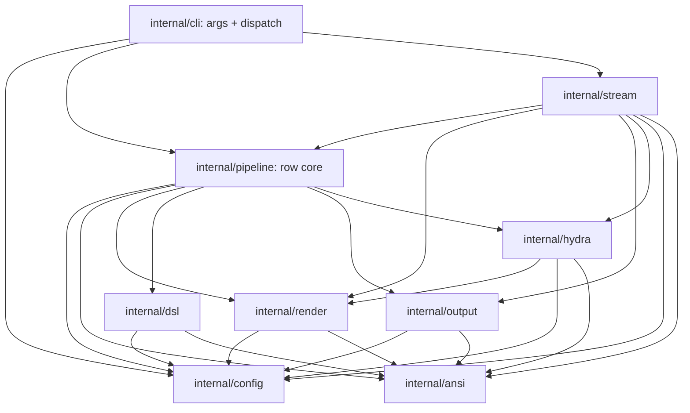
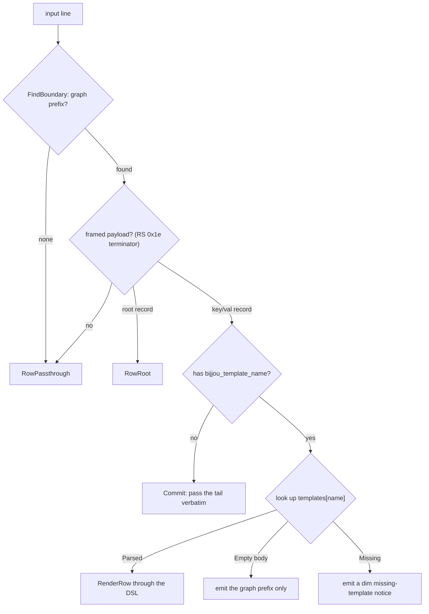
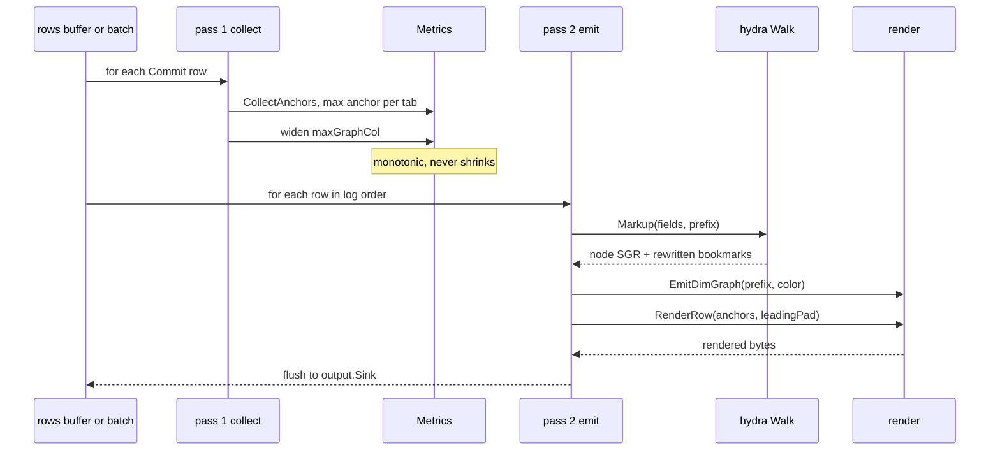
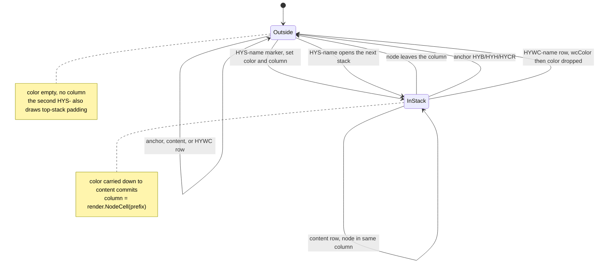
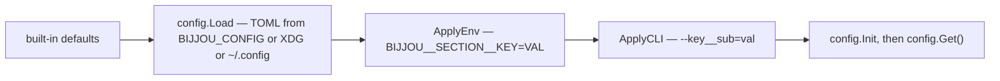
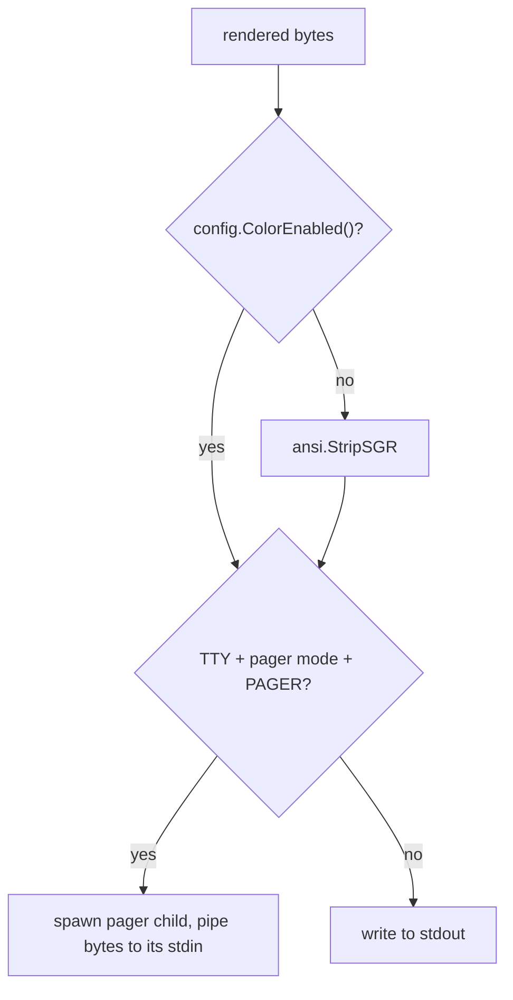

# Architecture

`bijjou` is a stdin/stdout filter. It post-processes `jj log` output. It
rewrites edge glyphs, dims edges, and re-renders per-commit content from a
NUL/RS-framed payload through a small templating DSL. A custom jj log
template emits the payload (see `bijjou-jj-config.toml`). Each payload names
a `bijjou` template through a `bijjou_template_name` field, which selects one
of the configured `[templates]` entries. Lines that are not framed commit
rows pass through byte-for-byte. jj's template owns the node glyphs. `bijjou`
recognizes them but never rewrites them. `bijjou` can be configured to process
[`hydra`](https://tangled.org/jjt.io/jj-hydra) megagmerge topologies to apply colors to stacks and replace `hydra`
bookmarks with alternative symbols.

## Pipeline

```
stdin → activation check → (stream | buffered) → classify → render → output sink → stdout|pager
```

The next diagram shows the full flow, with both the streaming and buffered
paths.



- **Activate gate** (`config.ModeNever|ModeAuto|ModeAlways`): `ModeNever` =
  raw copy. `ModeAuto` = look for the `bijjou_template_name` field in input,
  else passthrough (in streaming mode, the scan covers only the first batch).
  `ModeAlways` (default) = process every line.
- **Stream vs buffered**: `[stream].enabled` switches paths (default on).
  `cli.dispatch` reads the gate and picks the path.
  - Stream (`internal/stream`): read in batches, two-pass per batch, flush as
    input arrives. Batch size is `[stream].batch-size` — a fixed line
    count (default 128) or `half-pager` (first batch = `rows-1`, each
    later batch = `(rows-1)/2`).
  - Buffered (`pipeline.RunBuffered`): read all of stdin, two-pass once, emit.

## Templates

A `[templates]` table maps names to DSL bodies. `bijjou` compiles them once at
startup into `CompiledTemplate` (`pipeline.CompileTemplates`). Each commit
row's `bijjou_template_name` field picks the entry to render with:

- **Parsed** body → render the row through the DSL.
- **Empty** body (`name = ""`) → emit the graph prefix only, and drop the
  rest of the row.
- **Missing** (name not in `[templates]`) → emit a dim
  `no bijjou template for <name>` notice in place of the content.
- **No name** (row parsed as fields but carried no `bijjou_template_name`)
  → pass the rest of the line through verbatim instead of dropping it.

`bijjou` scans a template body byte by byte and widens each byte to one
codepoint, so a non-ASCII literal between `%{...}` tags renders as mojibake.
The Go port keeps the behaviour of the Rust implementation, and field values
are not affected.

## Modules

| Package             | Job                                                                                      |
| ------------------- | ---------------------------------------------------------------------------------------- |
| `internal/cli`      | Argument handling, config load chain, dispatch (raw copy vs stream vs buffered). The cobra command runs through `fang`, which owns the styled help, the error output and the shell completions. `cli` sits above `pipeline` and `stream`, so the two never import each other. |
| `internal/pipeline` | The shared row core: `Row` / `RowKind`, `ClassifyRow`, `EmitClassified`, template compilation, and per-template `Metrics` (position-keyed anchors). It also owns the buffered path (`RunBuffered`). |
| `internal/config`   | `Config` struct, TOML/env/CLI merge, process-wide `Get()`. Precedence file < env < CLI      |
| `internal/ansi`     | Byte-level ANSI utils: CSI skip, UTF-8 decode, SGR filter/strip                          |
| `internal/render`   | Parse line → `Parsed{GraphCol, GraphColCollapsed, GraphEnd, ContentStart, LastIsEdge, LastIsEdgeCollapsed}`. Recognize edges (box-drawing and elision) by codepoint, and nodes structurally (any non-edge glyph in the graph region, including custom `log_node` glyphs). Emit dimmed edges, and drop inter-column pad cells under `graph.collapse`. Node bytes (and their surrounding ANSI) pass through unchanged. Node coloring is jj's job, unless the caller hands `EmitDimGraph` a `hydra` stack color. `GraphNodesToVerticals` rewrites a prefix's node back into a vertical, for the `hydra` padding row. `NodeCell` reports the cell a prefix's node sits in, which is how `hydra` bounds a stack to its own column. |
| `internal/dsl`      | Templating DSL and NUL/RS-framed record parser (`ParseNULOneline`). `Parse` builds an AST of literal text, `%{field}` lookups, and `%{elastic_tab(field)}` align points. Two-pass render (`CollectAnchors` → `RenderRow`). Pass 1 records each elastic-tab's max natural column (anchor), keyed by tab position. Pass 2 left-pads to the anchor so the following content's left edge lines up. An arg-ful tab then emits its field inline. An arg-less tab emits nothing (`%{elastic_tab()}%{X}` == `%{elastic_tab(X)}`). Whitespace follows a 4-rule model (see below). |
| `internal/stream`   | Batched reader (`readBatch`), two-pass per batch with monotonic widening (anchors and graph-column targets never shrink as new batches arrive), and the write loop over `output.Sink` (stdout or a pager child). |
| `internal/hydra`    | Hydra awareness. `newTopology` expands `hydra.prefixes` into the bookmark names in force (`HYS-`, `HYWC-`, and the `HYB` / `HYH` / `HYCR` anchors), with the stand-in each reads as under `hydra.prefixes-replace`. A `Walk` (and a pass-1 `Renamer`) builds it once from `config.Get()` and holds it, so the run needs no global. `Walk` is the per-row state. It classifies each commit row by its `bookmarks` field (stack marker, working copy, anchor, or neither). It carries a stack's color down from its marker to the content commits under it in the same graph column (`render.NodeCell`), so a commit drawn in another column is nobody's stack. It colors a `HYWC-*` row with its stack's color without carrying it. It draws the top-stack separator row. `Walk.Markup` returns the row's node SGR. Under `hydra.color-bookmarks` or any `hydra.prefixes-replace` key, it also returns a rewritten `bookmarks` field whose `hydra` names carry their stack's color instead of jj's and read under their stand-ins (`RenderRow`'s field override). `Renamer.ReplaceNames` is the same substitution without the colors, for pass 1's anchors. No subprocess, so nothing to wait on. |
| `internal/output`   | Terminal write and pager child (`os/exec`, bytes piped to the child's stdin). Both the buffered and the streaming path write through it. |

The packages depend on each other as this diagram shows. `config` and `ansi`
import no other package.



## Render flow per line

1. `FindBoundary` → locate end of graph prefix. A position is "graph"
   when its codepoint is an edge (box-drawing range or elision char). A
   position is also "graph" when it is a node. `bijjou` recognizes a node
   structurally, as any non-edge, non-space glyph that a space or an edge
   follows (the column gap jj pads after every node). So `bijjou` handles
   custom `log_node` glyphs (□, Nerd-Font PUA, and more) without a list of
   them. It never misreads content, because content's first glyph always
   sits past the gap. `LastIsEdge` records whether the prefix ended on an
   edge or a node.
   Under `graph.collapse`, `bijjou` drops the pad cell of every graph column
   (`isPadCell`: an odd cell index that holds a space or a horizontal), so
   column N lands at cell N. `Parsed` carries both column counts and both
   `LastIsEdge` flags. `ClassifyRow` picks the pair that matches the
   config, so the graph→content gap matches the prefix `bijjou` emits. Parity
   keeps this safe: horizontals that *are* a column's glyph (`├───╯`) and one
   cell of every inactive column survive. Passthrough rows with no boundary
   collapse only when `IsGraphOnly` holds. Prose that holds a stray
   box-drawing char must not lose every second character.
2. `ClassifyRow` → after the graph prefix, look for a NUL/RS-framed
   payload (`key\0val\0…\x1e`, which the custom jj log template emits).
   Lines that parse become `RowCommit`, which carries `GraphCol`,
   `GraphEnd`, `LastIsEdge`, `TemplateName`, and `Fields`. A record that
   is just `root\0<value>` becomes `RowRoot`. Anything else stays
   `RowPassthrough`.
3. Pass 1 over the buffer (or batch): per named template, `CollectAnchors`
   records each elastic-tab's max natural column (anchor), keyed by tab
   position. It also tracks the overall max `GraphCol` across commit rows.
4. Pass 2 — `EmitClassified`:
   - Commit: `hydra.Walk.Markup` gives the row's stack color (and the
     top-stack separator row, when this row opens the second stack).
     `EmitDimGraph` gives the graph prefix. Right-pad to the max graph
     column (the DSL takes this as a leading pad). Then dispatch on the row's
     template (Parsed / Empty / missing / no-name — see **Templates**). For a
     Parsed body, `RenderRow` walks the template. Literal text and
     `%{field}` lookups emit verbatim. `%{elastic_tab(...)}` left-pads to its
     column's anchor (the fill is one space for a one-cell gap, otherwise
     dashes with `layout.dash-start` / `layout.dash-end` caps). Then an
     arg-ful tab emits its field value, and an arg-less tab emits nothing.
   - Root: emit the graph prefix, then a 2-cell pad and the `root` value
     verbatim (no template), so root commits do not perturb column widths.
   - Passthrough: `render.EmitLine` handles the graph-only and
     unframed cases (just the edge-dim rewrite and verbatim tail).

`ClassifyRow` sorts each line into one row kind. Pass 2 then dispatches on
the row's template.



The two render passes run in this order.



## Hydra markup

A `hydra` merges linear stacks as siblings off one base, so `jj log` gives each
stack a graph column. The bookmark naming is configurable per repo. So
`internal/hydra` reads it from `hydra.prefixes` and expands it once into
`topology{stackPrefix, wcPrefix, anchors}`, plus the stand-in each of those
reads as under `hydra.prefixes-replace`. Each `Walk`, and each pass-1
`Renamer`, builds the topology once from `config.Get()` and holds it. So both
passes read the same names, and the run holds no package-level state. A repo
with no `hydra` carries no bookmark that matches, which is the same as no
markup. A `hydra status --toml` call is authoritative, but it calls jj several
times per log, which costs more than the whole render.

`Walk.Markup` runs once per commit row, in log order, from
`EmitClassified`:

- A row that carries `HYS-<name>` opens that stack. A row that carries an
  anchor (`HYB` / `HYH` / `HYCR`) leaves `hydra` territory. A row that carries
  `HYWC-<name>` leaves it too. A working copy sits above the head, outside
  every stack. But the row is that stack's, so `bijjou` colors it with the
  stack's color and carries nothing onward. Anything else — a stack's content
  commits, which name no bookmark — keeps whichever state the walk is in.
  This is how a color reaches them. `bijjou` strips remote refs (`name@remote`)
  and jj's out-of-sync `*` flag first, because `commit.bookmarks()` carries
  both.
- The column bounds a stack at the bottom. A marker records the cell its node
  sits in (`render.NodeCell` over the row's own graph prefix, which counts
  jj's two cells per column). A bookmarkless row keeps the stack's color only
  while its node stays in that cell. A commit drawn in another column is
  nobody's stack, so it keeps jj's colors, and the stack does not resume
  under it. An extra head off the base, below the log's bottom stack and
  above `HYB`, is one example.
- The row's node color is the stack's. `bijjou` hashes it from the stack's name
  (`hydra.colors = true`), or takes the palette entry for its index. The
  index is the order the log first named that stack, held for the rest of the
  run. Working-copy rows come above the stacks, so they register the order.
  The hash walks `hueSpace` — the hue circle less `reservedHues`, 10°
  either side of `#a6e3a1` (115°) and `#f5c2e7` (316°). `hueOf` maps its
  index back onto real degrees and skips the bands, so the hues stay evenly
  spread. `bijjou` passes a configured palette through as written.
- Under `hydra.color-bookmarks` (default on), `bijjou` puts the same color on
  the names themselves. Under `hydra.prefixes-replace`, `bijjou` prints the
  names under their stand-ins. `rewriteBookmarks` splits the `bookmarks`
  field on whitespace. For each `HYS-*` / `HYWC-*` / anchor token,
  `emitToken` drops jj's foreground SGRs (colors only), puts the stack's
  color in front, and substitutes the token's leader for its stand-in. The
  rewritten field reaches `RenderRow` as a per-row field override. Every
  other bookmark on the row passes through byte-for-byte.
- A stand-in is not the width of the name it replaces, so pass 1 must measure
  the anchors on the rewritten field too. `AccumulateMetrics` calls
  `hydra.Renamer.ReplaceNames` — the same substitution, colorless, which
  needs no walk state — and hands it to `CollectAnchors` as the same kind of
  override. A recolor alone changes no width, so `hydra.color-bookmarks`
  needs nothing in pass 1.
- When the *second* stack opens, `bijjou` draws the separator row that jj
  skipped under the first. It runs `GraphNodesToVerticals` on that row's
  own graph prefix, back through `EmitDimGraph`, so every column lands
  where it does above and below (under `graph.collapse` too).

The walk is single-pass and stateful, so it works the same on the buffered
and streaming paths. It assumes jj's default top-down order. Under `jj log
--reversed`, a stack's commits precede its marker, and the walk cannot
follow.

The walk holds one of two states as it reads the log from top to bottom.
`markOf` classifies each row into a `mark`: `markStack`, `markInside`,
`markWorkingCopy`, or `markOutside`. The `mark` drives the transition.



## DSL whitespace model

`RenderRow` classifies output into segments (`segContent`, touchable `segWs`,
elastic-tab left-pad `segAnchor`, and zero-width `segEmptyTag`) and applies
four rules in order:

1. `bijjou` preserves leading whitespace before the first non-whitespace
   character verbatim (it never collapses, even when the first field is
   empty).
2. When a `%{}` block emits empty bytes, every whitespace cell between it
   and the nearest non-whitespace character to its **left** collapses to
   zero. `segAnchor` cells stop the walk — column-alignment survives empty
   values.
3. After rules 1-2 and elastic-tab alignment, `bijjou` dash-fills any run of
   consecutive whitespace cells (single cells stay spaces, and runs of two or
   more become a capped dash run). The graph→content gap joins this fill with
   the template's own whitespace.
4. `bijjou` never modifies bytes that come from a `%{}` block. Internal
   whitespace inside a value passes through untouched.

## Dash spec

A "dash run" is the filler between a graph node and the rest of the commit
info on the same line. The spec is the single source of truth for both the
intra-graph runs (`render`'s `graphRun.flush`) and the graph→content /
inter-field runs (`dsl.emitPad`).

- A dash run goes between a graph **node** (not a graph edge) and the
  rest of the commit info on the line.
- Dashes are logically continuous from the node out to the content. Graph
  **edges** in the way puncture the run, but the run resumes on the other
  side of the edge.
- `bijjou` never emits dashes on top of a graph edge cell.
- From left to right, the cell immediately right of a node uses
  `layout.dash-start` (default `╶`). But it does so **only** when that cell
  is also to the left of whitespace or a graph edge. If the cell right of a
  node sits directly to the left of another node, `bijjou` emits no dash at all
  (it keeps the space). If that cell sits directly to the left of content, it
  is the lone closing cell instead.
- The closing cell — the one immediately left of the content the run
  terminates against — is never a dash. It holds `layout.dash-end`, which
  defaults to `""`, that is, a plain space, so content always has a space to
  its left (`○╶───── qquxkvlu`, `●╶𜸩 vqyvkx`). Set it to `╴` for the
  half-line cap that mirrors `dash-start`.
- A one-cell run is nothing but its closing cell.
- All other cells in the run use `layout.dash` (default `─`).

Set `layout.dash-start = ""` to drop the opening cap (that cell becomes a
plain dash).

## Config surface

One `Config` holds every setting. Three layers merge into it:

1. `config.Load` → read TOML from `$BIJJOU_CONFIG` | XDG | `~/.config/...`.
   Writes the embedded `bijjou-config.toml` to the XDG path on first run.
2. `ApplyEnv` → `BIJJOU__SECTION__KEY=VAL`.
3. `ApplyCLI` → `--key__sub=val` (plus shorthands `--activate`,
   `--color`, `--stream[=bool]`).

The three layers merge from low to high precedence. Then `config.Init` records
the result, and `config.Get()` returns it everywhere.



Keys: top-level (`activate`, `pager`), `[ui].color`,
`[layout]` (`dash`, `dash-start`, `dash-end`), `[templates].<name>`,
`[stream]` (`enabled`, `batch-size` = int | `"half-pager"`),
`[graph]` (`collapse`), `[graph.edges.chars]`, `[colors]`
(`dash-filler`, `graph-edge`), `[hydra]` (`enable`,
`top-stack-padding`, `color-bookmarks`, `colors` = `true` | `false` |
comma/TOML list of `int 0-255 | "#rrggbb"`), `[hydra.prefixes]` (`prefix`, `base`, `head`,
`conflict-resolution`, `stack-head`, `stack-working-copy`),
`[hydra.prefixes-replace]` (the same keys, each optional, each the rendered
stand-in for that name's leader), plus the hidden
`debug.force-screen-height`. Full ref: `bijjou-config.toml`.

## Output

- TTY + `pager=auto|always` + `$PAGER` set → spawn a pager child
  (`os/exec`) and pipe the bytes to its stdin.
- Else → write to stdout.
- `--color=auto` strips SGR when stdout not a TTY (via `ansi.StripSGR`;
  gated by `config.ColorEnabled`).

`bijjou` selects the output path from the color and pager settings.



## Tests

- Golden tests in `golden_test.go` (package `main_test`), with the expected
  text in `testdata/golden/*.txt` and the inputs in
  `testdata/fixtures/*.txt`. Each fixture renders under `bijjou-config.toml`
  with `ui.color` forced on and `hydra.enable` forced off (the `hydra` cases
  opt back in — the fixture's own `HY*` bookmarks carry the topology, so no
  test depends on a live `hydra`). Run `mise run test-golden`. After an
  intentional output change, rewrite the expected text with
  `mise run test-golden -- -update`. `BIJJOU_TEST_BIN=<path>` points the
  harness at a binary that is already built.
- Unit tests are Go package tests beside each package
  (`internal/render/render_test.go`, `internal/dsl/dsl_test.go`,
  `internal/ansi/ansi_test.go`, `internal/stream/stream_test.go`,
  `internal/config/config_test.go`, `internal/hydra/hydra_test.go`,
  `internal/pipeline/pipeline_test.go`). Run `mise run test-unit`.
